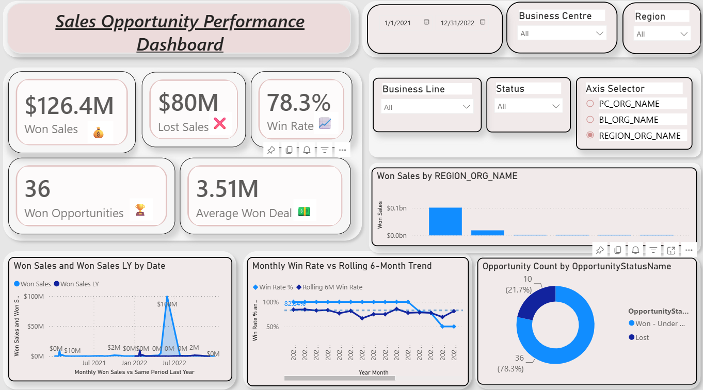

# 📊 Sales Opportunity Performance Dashboard | Power BI

## 📌 Project Overview

The Sales Opportunity Performance Dashboard is an interactive Power BI report designed to analyze sales performance, monitor KPIs, and provide actionable business insights. It enables users to track won and lost sales, evaluate win rates, monitor regional performance, and identify sales trends through interactive visualizations.

---

## 🚀 Live Dashboard

🔗 https://app.powerbi.com/links/RINxdzgucT?ctid=45d49bec-2828-46e2-ac06-f38755f4d747&pbi_source=linkShare

---

## 📷 Dashboard Preview

> Add your dashboard screenshot here.



---

## 📈 Key KPIs

- 💰 Won Sales: **$126.4M**
- ❌ Lost Sales: **$80M**
- 📊 Win Rate: **78.3%**
- 🏆 Won Opportunities: **36**
- 💵 Average Won Deal Value: **$3.51M**

---

## ✨ Features

- Interactive KPI Cards
- Date Range Filter
- Region Filter
- Business Centre Filter
- Business Line Filter
- Status Filter
- Dynamic Axis Selector (Field Parameters)
- Monthly Win Rate Trend
- Rolling 6-Month Win Rate
- Year-over-Year Sales Comparison
- Opportunity Status Analysis
- Regional Sales Performance

---

## 🛠️ Tools & Technologies

- Power BI Desktop
- Power Query
- DAX
- Data Modeling
- Field Parameters
- Interactive Visualizations

---

## 📊 Business Insights

- Identified overall sales performance and win rate.
- Compared Won Sales with Previous Year performance.
- Analyzed monthly sales trends.
- Evaluated regional sales distribution.
- Tracked opportunity status across the sales pipeline.
- Monitored average deal value and opportunity conversions.

---

## 📁 Repository Structure

```
Sales-Opportunity-Performance-Dashboard/
│
├── Dashboard.pbix
├── images/
│   └── dashboard.png
├── Dataset/
│   └── Sales_Data.xlsx
└── README.md
```

---

## 👩‍💻 Author

**Mayuri Lohote**

- LinkedIn: https://www.linkedin.com/in/mayurilohote/
- GitHub: https://github.com/mayurilohote
